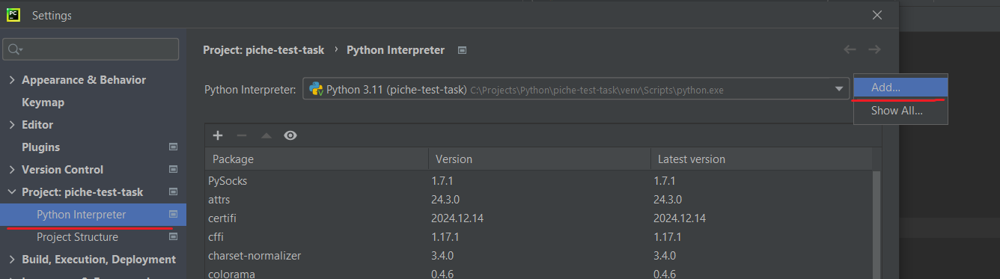
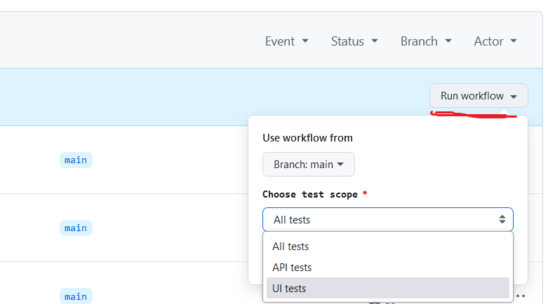
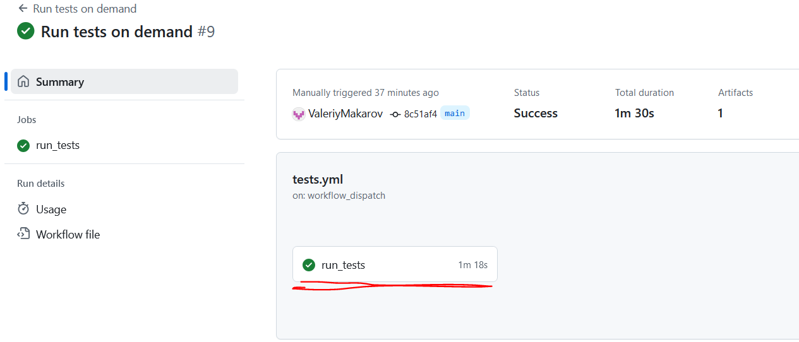
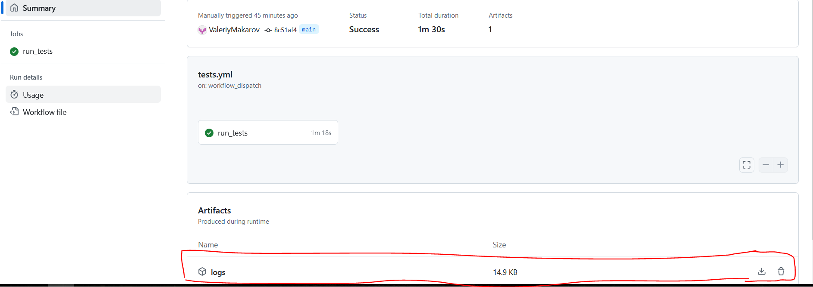

# Piche test task
___
## Summary
This is the test task for interview in Pitch company.
You can see here 3 automated tests (2 API and 1 UI).

There are:
* attached pdf file with the task
* configuration files for git, pytest and venv
* `core` folder with some methods for tests
* `media` folder for media from Readme.md
* `tests/API_tests` folder for API tests
* `tests/UI_tests` folder for UI tests with Selenium
* `tests/test_data` folder with data for tests

After run of the tests a folder `test_run_data` for test logs will be created there.
If you won`t run test using command in the terminal, this folder will be created beside main test file.

I also configured CI/CD to run tests manually from Github actions. Please check it.

## How to run tests:

### You can run it using Pycharm:
1. Clone the project.
2. Create venv:
* Go to File > Settings > Project > Python interpreter.

* Click Add button and choose Base interpreter, then click Ok button.

* Click Apply.

* Open terminal in Pycharm. Venv should be activated.

3. Run `-r requirements.txt` to install all needed python modules.

4. Run `pytest` or `pytest -m ` + any mark from next list: smoke, ui, api.

You can observe test logs in console or open `test_run_data` folder and look through the files.

### You can run it in Github
1. Contact me and send me your email or Github nickname, so I can add you as collaborator to repository.
2. Open Git Actions and go to "Run tests on demand" workflow.

3. Click "Run workflow" and choose which tests you would like to run.

You can observe test logs in git console or download it as archive and look through the files:
* To see console, open started workflow and click on the button with job name.

* To download logs, open started workflow and click on artifacts field.

